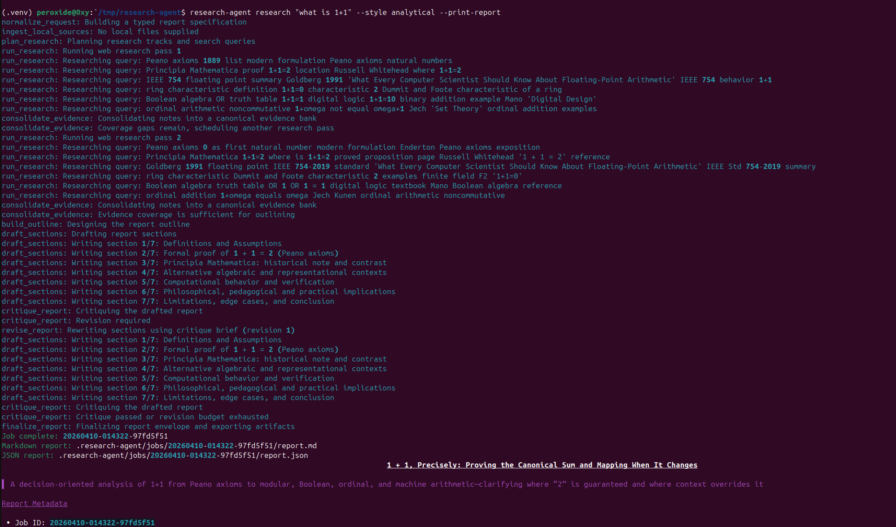

# Research Agent



CLI-first deep research agent built with LangChain, LangGraph, and the OpenAI API.

It turns a user request into a structured research workflow:

1. Normalize the request into a typed report specification.
2. Plan search tracks and section strategy.
3. Run OpenAI-backed web research.
4. Optionally analyze local files.
5. Consolidate evidence and identify gaps.
6. Draft a report in a requested style such as `narrative`, `analytical`, `briefing`, `comparative`, `literature_review`, or `due_diligence`.
7. Critique the draft and revise once before export.

## Features

- CLI-first workflow with local job artifacts.
- LangGraph orchestration with explicit planning, research, synthesis, critique, and revision stages.
- OpenAI web search via the Responses API through `langchain-openai`.
- Style-aware reporting with separate guidance for narrative, analytical, briefing, comparative, literature review, and due diligence outputs.
- Local file ingestion for `.txt`, `.md`, `.rst`, `.json`, `.csv`, and `.pdf`.
- Markdown and JSON report artifacts per run.

## Install

```bash
python3 -m venv .venv
source .venv/bin/activate
pip install -e .
```

Set your key:

```bash
cp .env.example .env
```

Then fill in `OPENAI_API_KEY`.

## Run

```bash
research-agent research "Assess the current AI browser agent landscape and recommend where a startup should differentiate." \
  --style analytical \
  --audience "product and engineering leadership" \
  --depth deep \
  --desired-length 2600 \
  --print-report
```

With local files:

```bash
research-agent research "Summarize and compare these internal strategy documents." \
  --style comparative \
  --file ./docs/strategy-a.pdf \
  --file ./docs/strategy-b.md
```

List previous jobs:

```bash
research-agent list-jobs
```

Inspect a previous job:

```bash
research-agent inspect 20260410-120000-ab12cd34
```

## Output

Each run creates a job folder under `.research-agent/jobs/<job-id>/` with:

- `request.json`
- `spec.json`
- `plan.json`
- `notes.json`
- `evidence_bank.json`
- `outline.json`
- `critique.json`
- `sources.json`
- `report.json`
- `report.md`
- `state.json`
- `events.log`
